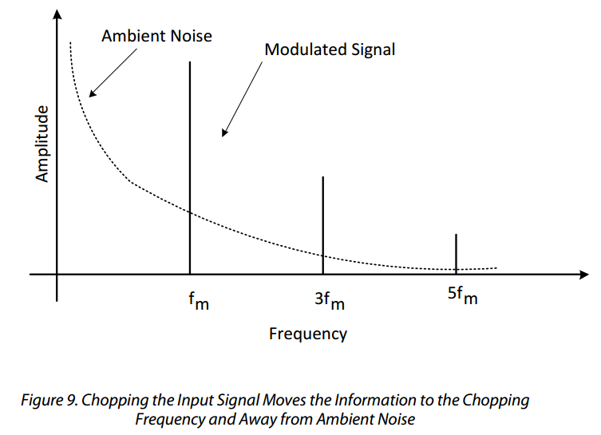

# Turbidity sensor prototype

## Background

Turbidity, an optical technique for assessing suspended solids in liquid -- is an important water quality parameter.  Typically, light is shone into a liquid sample, and the amount of light scattered back out of the sample (off of particles suspended in it) is measured; the intensity of this scattered light is considered to be related to the amount of suspended solids in the sample.  

**Avoiding ambient light effects**. The circuit design in this repository uses a modulation and filtering technique in order to dimish the effects of ambient light, reducing the need for elaborate enclosure designs.  

_Source:  http://www.analog.com/media/en/technical-documentation/technical-articles/Optimizing-Precision-Photodiode-Sensor-Circuit-Design-MS-2624.pdf_

The basic idea, described [here](http://www.analog.com/media/en/technical-documentation/technical-articles/Optimizing-Precision-Photodiode-Sensor-Circuit-Design-MS-2624.pdf), is to send a pulsed light signal into the liquid at a frequency F that is significantly higher than the anticipated frequencies of light changes due to ambient lighting effects;  the light that scatters back off particles in the water is then measured using electronic techniques that filter out any signals with a frequency much less than F.  The intended result is that only the scattered light from the emitter, and not scattered light from other ambient sources, is detected.  

## Circuit

The circuit consists of two main parts -- an **emitter** (the light source shone into the water) and a **detector** (the light measurement).

The **emitter** is a photodiode (with wavelength around 800 nm, as this is considered to have better scattering properties for turbidity measurements [REF]), pulsed via 'pulse width modulation' [REF] via a pin on the Riffle (a PWM Arduino IDE pin) at a frequency of about 2 kHz.  

The **detector** consists of a transimpedance amplifier photodiode circuit, followed by a rectifier (to only allow 'positive' amplitude pulses through) and a high-pass filter (to suppress frequencies lower than the emitter frequency -- in this case, with a cutoff of about 1.5 kHz).

## Bill of Materials

The required components for the circuit are:

- A JFET Op Amp like the [AD820](http://www.analog.com/media/en/technical-documentation/data-sheets/AD820.pdf)
- Emitter: [SFH 213](http://www.osram-os.com/Graphics/XPic5/00101689_0.pdf)
- Detector: [HIR204](http://www.osram-os.com/Graphics/XPic5/00101689_0.pdf)
- Two 1 kiloOhm resistors
- One 1 megaOhm resistor
- Two 0.1 microFarad capacitors

## Schematic 

## Diagram for Riffle Protoboard

## Code

Arduino IDE code for this circuit (see 'riffle_turbidity.ino' in this repoistory) merely requires generating a pulse width modulated frequency on the emitter circuit at the appropriate frequency, and then measuring the analog output voltage of the filter circuit. No special libraries are required.
 
## Calibration

[REF for DIY turbidity sensor and associated techniques]

