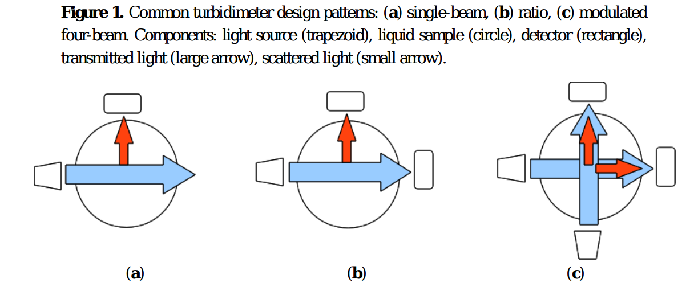
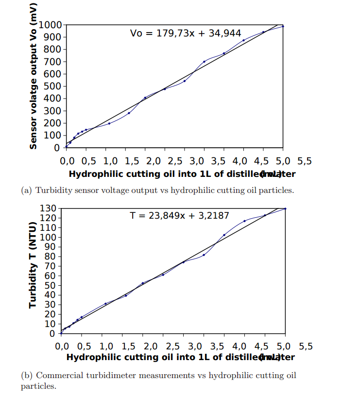
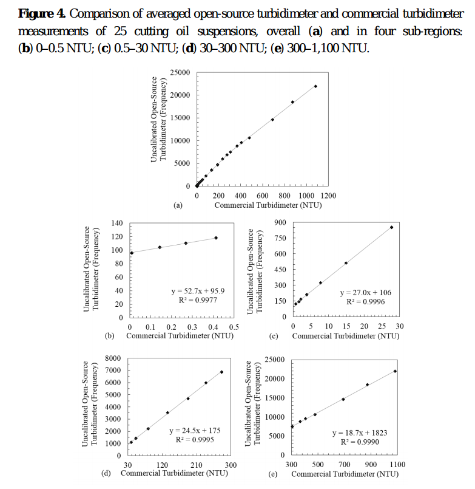

# Turbidity sensor prototype

## Background

Turbidity, an optical technique for assessing suspended solids in liquid -- is an important water quality parameter.  Typically, light is shone into a liquid sample, and the amount of light scattered back out of the sample (off of particles suspended in it) is measured; the intensity of this scattered light is considered to be related to the amount of suspended solids in the sample.  

**Avoiding ambient light effects**. Most of the 'DIY' methods in the literature [1], [2], [3] for measuring turbidity avoid ambient light contamination by creating an opaque enclosure around the sample being tested (a sample holder inside a light-tight box). For a field-based instrument, measurements must be done continuously, and allow for the passage of fluid through the sampling area.  This requirement of fluid flow makes designing a light-tight enclosure difficult, adding to the cost of the design.

The circuit design in this repository takes a different approach: it uses a light pulse modulation and filtering technique that, in principle, does not require a light-tight enclosure. 

( _Source:  http://www.analog.com/media/en/technical-documentation/technical-articles/Optimizing-Precision-Photodiode-Sensor-Circuit-Design-MS-2624.pdf_ )

The basic idea, described [here](http://www.analog.com/media/en/technical-documentation/technical-articles/Optimizing-Precision-Photodiode-Sensor-Circuit-Design-MS-2624.pdf), is to send a pulsed light signal into the liquid at a frequency F that is significantly higher than the anticipated frequencies of light changes due to ambient lighting effects;  the light that scatters back off particles in the water is then measured using electronic techniques that filter out any signals with a frequency much less than F.  The intended result is that only the scattered light from the emitter, and not scattered light from other ambient sources, is detected.  

## Circuit

The circuit consists of two main parts -- an **emitter** (the light source shone into the water) and a **detector** (the light measurement).

The **emitter** is a photodiode (with wavelength around 800 nm, as this is considered to have better scattering properties for turbidity measurements [REF]), pulsed via 'pulse width modulation' [REF] via a pin on the Riffle (a PWM Arduino IDE pin) at a frequency of about 2 kHz.  

The **detector** consists of a transimpedance amplifier photodiode circuit, followed by a rectifier (to only allow 'positive' amplitude pulses through) and a high-pass filter (to suppress frequencies lower than the emitter frequency -- in this case, with a cutoff of about 1.5 kHz).

## Bill of Materials

The required components for the circuit are:

- A JFET Op Amp like the [AD820](http://www.analog.com/media/en/technical-documentation/data-sheets/AD820.pdf)
- Emitter: [SFH 213](http://www.osram-os.com/Graphics/XPic5/00101689_0.pdf)
- Detector: [HIR204](http://www.osram-os.com/Graphics/XPic5/00101689_0.pdf)
- Two 1 kiloOhm resistors
- One 1 megaOhm resistor
- Two 0.1 microFarad capacitors

## Schematic 

## Diagram for Riffle Protoboard

## Code

Arduino IDE code for this circuit (see 'riffle_turbidity.ino' in this repoistory) merely requires generating a pulse width modulated frequency on the emitter circuit at the appropriate frequency, and then measuring the analog output voltage of the filter circuit. No special libraries are required.
 
## Calibration Methods

The EPA Standard Method 180.1 for calibrating turbidimeters uses formazin -- an expensive, hazardous chemical -- or one of a few approved alternatives (which tend to be expensive).  

Researchers in [3] initially attempted using suspensions of skim milk for calibrating their device, but eventually determined that these suspensions changed too quickly over time to be useful as turbidity standards. Instead, they chose to use suspensions of hydrophilic cutting oil, which they found to be relatively stable.  The project in [1] also followed this approach.  

In both cases, the same samples were measured with the DIY device and with a commercial turbidimeter device (Hach 2100P in [3], MicroTPI model from HF Scientific in [1]), and linear curve was found to describe the relationship between the DIY device output and that of the commercial instrument.  

[1] Kelley et al., An Affordable Open Source Turbidimeter http://www.mdpi.com/1424-8220/14/4/7142/pdf
[2] Hackteria.org, Turbiduino:  http://hackteria.org/wiki/DIY_turbidity_meters
[3] Lambrou et al., A Nephelometric Turbidity System for
Monitoring Residential Drinking Water Quality: http://www2.ucy.ac.cy/~faniseng/publications/SENSAPPEAL09.pdf
[4] Cutting oil:  https://www.amazon.com/CRC-14050-Cutting-Thread-Lubricant/dp/B000M8NYIU

To convert sensor output to report turbidity, it was necessary to empirically match the sensor’s
pulse train frequency to corresponding NTU values, and to store this calibration routine in persistent
memory of the microprocessor. EPA Standard Method 180.1 states that turbidimeters should be
calibrated against aqueous suspensions of the polymer formazin, or an approved formazin
alternative [8]. Because formazin is a hazardous chemical that is relatively difficult to use on a routine
basis, an alternative was sought. To avoid the extensive cost of purchasing commercially available
formazin alternatives (which must be purchased at specified turbidities because they become unstable
if diluted), we created a series of 25 stable colloidal suspensions by diluting hydrophilic cutting oil
with distilled water, following the approach previously employed and reported by [21].
For calibration of the open-source instrument, each of the 25 cutting oil suspensions was stored in a
quartz cuvette and measured eight times with the open-source turbidimeter and eight times with a
commercial ratio-based turbidimeter purchased as the standard of comparison for this experiment
(MicroTPI model; HF Scientific, Fort Meyers, FL, USA). Concentrations, measured with the
commercial instrument, ranged from roughly 0.01 to 1100 NTU. Averaged readings from the
open-source turbidimeter for each cutting oil suspension were regressed on averaged readings from the
commercial device to develop the calibration curve. Since a primary objective of this experiment is to
affordably replicate the behavior of a commercial turbidimeter, individual readings of cutting oil
suspensions taken with the open-source turbidimeter were transformed with the calibration curve, and
compared to averaged readings from the commercial turbidimeter—these averaged readings from the
commercial turbidimeter taken as surrogates for the true turbidity values of the 25 suspensions. The
slope and intercept constants of this calibration routine were programmed into the microprocessor of
the open-source instrument, and the commercial and calibrated open-source turbidimeters were then
tested against five reference turbidity standards (0.02, 1, 10, 100, 1000 NTU, respectively) of an
EPA-approved formazin alternative (StablCal, purchased from Fisher Scientific, Pittsburgh, PA,
USA). Each reference turbidity standard was measured eight times with each of the turbidimeters. All
suspensions and standards were re-measured after 24 h to test for colloidal stability.

The EPA Standard Method 180.1 for calibrating turbidimeters uses formazin -- an expensive, hazardous chemical -- or one of a few approved alternatives (which tend to be expensive).  The researchers in [REF] decided to 

use cutting oil

Related work:

https://www.academia.edu/8319858/Open-source_mobile_water_quality_testing_platform

formazin

in all cases, design requires protection from ambient light

pull graphs from papers

design (befor epulse mod description):

show figure showing common designs

the show figure with scatter, making summary points from paper

then review deisgns made so far, and how they're lab sensors, not field sensors

point to sensor designs on public lab

