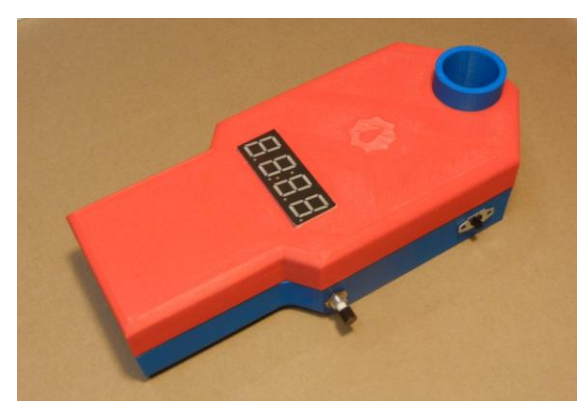
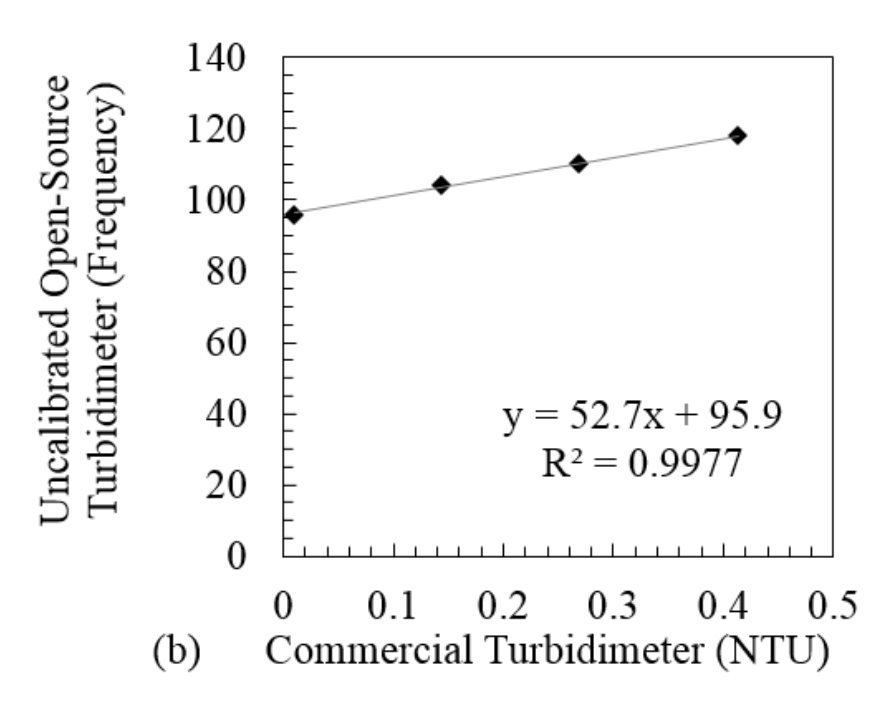
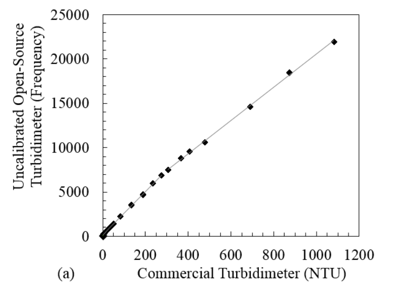
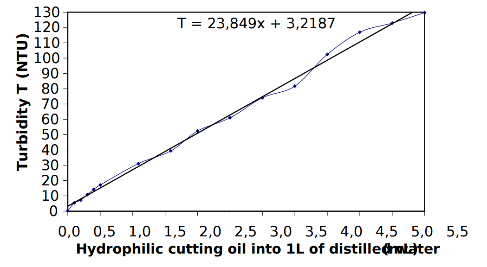

# Turbidity sensor prototype

## Background

Turbidity, an optical technique for assessing suspended solids in liquid -- is an important water quality parameter.  Typically, light is shone into a liquid sample, and the amount of light scattered back out of the sample (off of particles suspended in it) is measured; the intensity of this scattered light is considered to be related to the amount of suspended solids in the sample.  

Various instrumentation technqiues have been developed to mitigate the effects of particle size, color, and distrubtion when attempting to determine a simple 'concentration' metric from light-based measurements.  Most of these techniques involve special arrangements of the light sources and light detectors:

For the most basic arrangement (a single light source and single detector), it has been determined that the best arrangement for avoiding unwanted scattering artefacts is a 'right angle' arrangement between source and detector. 

**Avoiding ambient light effects**. Most of the 'DIY' methods in the literature [1], [2], [3] for measuring turbidity -- which are usually based on instrumetation that is typically located within a laboratory -- attempt to avoid ambient light contamination by creating an opaque enclosure around the sample being tested (a sample holder inside a light-tight box). 

_Source: Ref [1] below_

For a field-based instrument, measurements must be done continuously, and allow for the passage of fluid through the sampling area.  This requirement of fluid flow makes designing a light-tight enclosure difficult, adding to the cost of the design.

The circuit design in this repository takes a different approach: it uses a light pulse modulation and filtering technique that, in principle, does not require a light-tight enclosure. 

( _Source:  http://www.analog.com/media/en/technical-documentation/technical-articles/Optimizing-Precision-Photodiode-Sensor-Circuit-Design-MS-2624.pdf_ )

The basic idea, described [here](http://www.analog.com/media/en/technical-documentation/technical-articles/Optimizing-Precision-Photodiode-Sensor-Circuit-Design-MS-2624.pdf), is to send a pulsed light signal into the liquid at a frequency F that is significantly higher than the anticipated frequencies of light changes due to ambient lighting effects;  the light that scatters back off particles in the water is then measured using electronic techniques that filter out any signals with a frequency much less than F.  The intended result is that only the scattered light from the emitter, and not scattered light from other ambient sources, is detected.  

## Circuit

The circuit consists of two main parts -- an **emitter** (the light source shone into the water) and a **detector** (the light measuring device).

The **emitter** is a photodiode (with wavelength around 800 nm, as this is considered to have better scattering properties for turbidity measurements [REF]), pulsed via 'pulse width modulation' [REF] via a pin on the Riffle (a PWM Arduino IDE pin) at a frequency of about 2 kHz.  

The **detector** consists of a transimpedance amplifier photodiode circuit, followed by a rectifier (to only allow 'positive' amplitude pulses through) and a high-pass filter (to suppress frequencies lower than the emitter frequency -- in this case, with a cutoff of about 1.5 kHz).

## Bill of Materials

The required components for the circuit are:

- A JFET Op Amp like the [AD820](http://www.analog.com/media/en/technical-documentation/data-sheets/AD820.pdf)
- Emitter: [SFH 213](http://www.osram-os.com/Graphics/XPic5/00101689_0.pdf)
- Detector: [HIR204](http://www.osram-os.com/Graphics/XPic5/00101689_0.pdf)
- Two 1 kiloOhm resistors
- One 1 megaOhm resistor
- Two 0.1 microFarad capacitors

## Schematic 

## Diagram for Riffle Protoboard

## Code

Arduino IDE code for this circuit (see 'riffle_turbidity.ino' in this repoistory) merely requires generating a pulse width modulated frequency on the emitter circuit at the appropriate frequency, and then measuring the analog output voltage of the filter circuit. No special libraries are required.
 
## Calibration Methods

**Subsitutes for expensive standards.** The EPA Standard Method 180.1 for calibrating turbidimeters uses formazin -- an expensive, hazardous chemical -- or one of a few approved alternatives (which tend to be expensive).  

Researchers in [3] initially attempted using suspensions of skim milk for calibrating their device, but eventually determined that these suspensions changed too quickly over time to be useful as turbidity standards. Instead, they chose to use suspensions of hydrophilic cutting oil, which they found to be relatively stable.  The project in [1] also followed this approach.  

In both cases, the same samples were measured with the DIY device and with a commercial turbidimeter device (Hach 2100P in [3], MicroTPI model from HF Scientific in [1]), and linear curve was found to describe the relationship between the DIY device output and that of the commercial instrument.  

In the below figure from Ref [1]), for example, samples from 0 to 0.5 NTU (determined by the commercial instrument) were measured both with a commercial turbidimeter (x-axis), and with the DIY device (y-axis).  A linear fit was constructed for the resultant measurements in order to translate the DIY output units (in the case of this device, frequency) to the more standard NTU.

This linear model did not work as well across a wider range of turbidity; so the researchers in [1] broke the samples down into several distinct regions:  0–0.5 NTU; 0.5–30 NTU; 30–300 NTU; and 300–1,100 NTU, which were locally linear. 

**Avoiding expensive commercial instrumentation.** Cutting oil is inexpensive, and [widely available commercially](https://www.amazon.com/CRC-14050-Cutting-Thread-Lubricant/dp/B000M8NYIU); but commercial turbidimeters are not as accessible. 

Helpfully, the researchers in [3] used a similar approach to [1], but also published a figure showing the relationship between NTU and the various concentrations of cutting oil used in their samples:

## Developing inexpensive techniques

A useful research project would be to investigate, using a commercial turbidimeter, the variability in this relationship between NTU and cutting oil concentration, both within and across particular brands of cutting oil.    If it was found that, for example, a particular brand of cutting oil had a relatively consistent NTU vs. concentration, that brand could be recommended as an NTU standard.  

# Research Notes on Public Lab

- Overview of turbidity: https://publiclab.org/notes/donblair/08-25-2015/turbidity-001
- Simple 'reflection ratio' sensor: https://publiclab.org/notes/donblair/11-01-2015/turbidity-sensor-prototype
- Research on using pulse - filtering technique: https://publiclab.org/notes/donblair/03-08-2016/removing-ambient-background-light-from-turbidity-measurements-through-signal-modulation
- First tests of modulation - filtering technique: https://publiclab.org/notes/donblair/03-23-2016/sync-mod-for-ambient-background-removal-first-tests
- Ben Hickman's design:  https://publiclab.org/notes/bhickman/05-09-2016/turbidity-sensor

# References

1. Kelley et al., An Affordable Open Source Turbidimeter http://www.mdpi.com/1424-8220/14/4/7142/pdf
2. Hackteria.org, Turbiduino:  http://hackteria.org/wiki/DIY_turbidity_meters
3. Lambrou et al., A Nephelometric Turbidity System for
Monitoring Residential Drinking Water Quality: http://www2.ucy.ac.cy/~faniseng/publications/SENSAPPEAL09.pdf
4. Cutting oil:  https://www.amazon.com/CRC-14050-Cutting-Thread-Lubricant/dp/B000M8NYIU

# Guides to turbidity

- Fondriest review: http://www.fondriest.com/environmental-measurements/equipment/measuring-water-quality/turbidity-sensors-meters-and-methods/
- Hach overview: http://www.hach.com/asset-get.download-en.jsa?code=61798
- Wikipedia: https://en.wikipedia.org/wiki/Turbidity
- USGS http://water.usgs.gov/owq/FieldManual/Chapter6/6.7_contents.html

