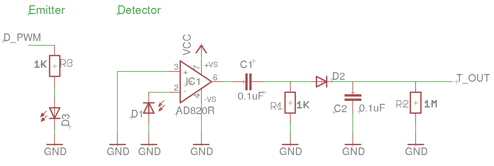
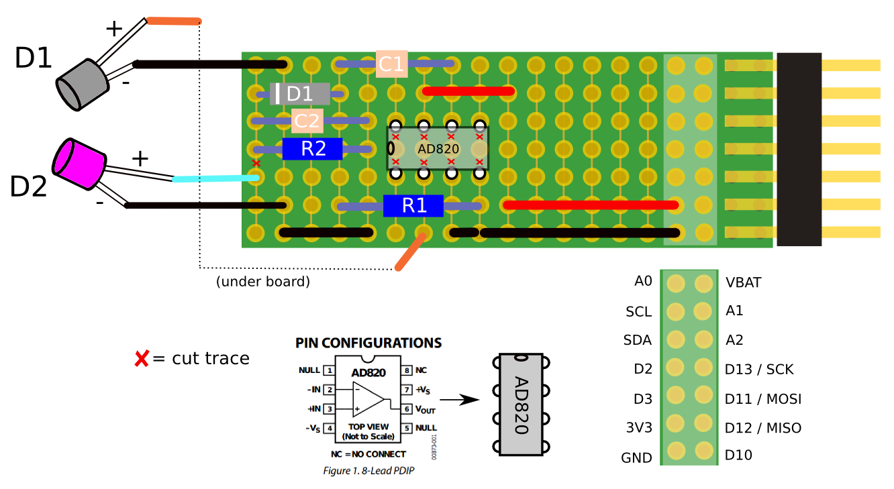

# riffle-turbidity

## Background

## BOM

[AD820 datasheet](http://www.analog.com/media/en/technical-documentation/data-sheets/AD820.pdf)

- LED part #, link to Digikey
- Photodiode part #, link to Digikey

## Schematic 

--------

